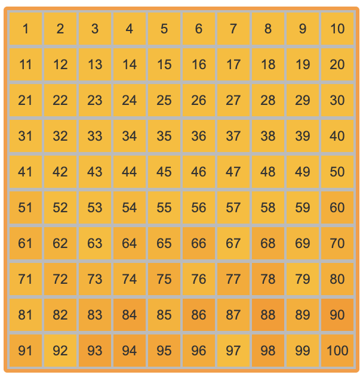

# project-euler

This repo tracks my progress on [Project Euler](https://projecteuler.net/archives) problems. Only problems up to and including the 100th problem will appear here.

### Progress

### Favourites
+ [Problem 12](https://projecteuler.net/problem=12): Highly Divisible Triangular Number.
  + *Neat little one - prime number properties come in handy.*
+ [Problem 62](https://projecteuler.net/problem=62): Cubic Permutations.
  + *Honestly I'm not sure why this has a higher difficulty rating, but I found it fun and quick to solve.*
+ [Problem 72](https://projecteuler.net/problem=72): Counting Fractions.
  + *Really nice counting problem that took some sieving ideas to get it up to speed.*
+ [Problem 86](https://projecteuler.net/problem=86): Cuboid Route.
  + *This one is a gem. It took a while to crack it and get the run time down to O(n**2) but very satisfying. 
  My first solution to a 35% rated problem.*
+ [Problem 82](https://projecteuler.net/problem=82): Path Sum: Three Ways.
  + *Really pleased to get this one. Took some thinking to find a solution that wasn't the naive O(n**n).
  So many paths!*
+ [Problem 88](https://projecteuler.net/problem=82): Product-sum numbers.
  + *Very satified to tick this one off. The best of my first two attempts got 29% through n=12000 before the 
  first minute elapsed. The final version involved some DP, and finished in ~1 second.*

### First 100, complete!

